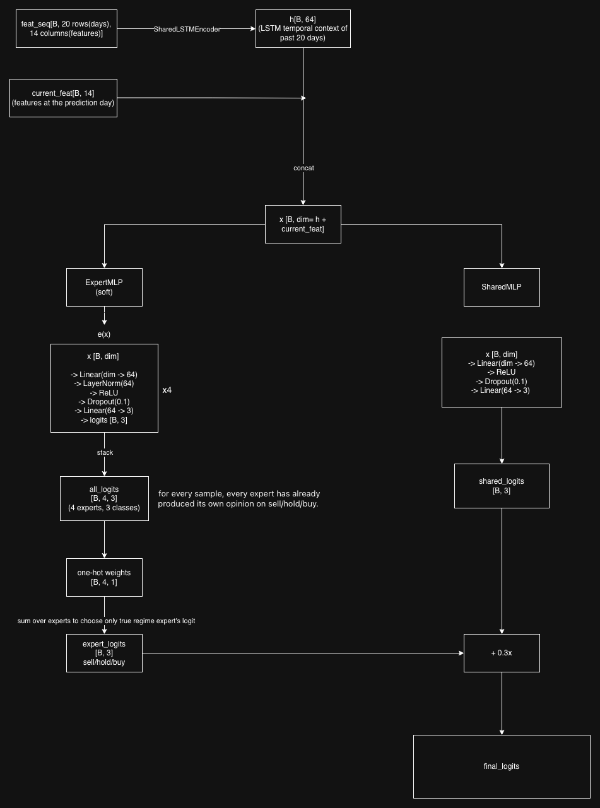

# To-Trade-or-Not-to-Trade

An quantitative pipeline for Vietnam stock data

## Features 
- **Data Preprocessing**
- **Feature engineering**
- **Feature selection**
- **Mixture of Expert model architecture**
- **Portfolio optimization**

## Project Structure 

```
To-Trade-or-Not-to-Trade/
│
├── data/
│   ├── data-vn-20230228/                   # Raw Vietnam market data
│   │   ├── stock-historical-data/          # OHLCV CSVs per stock (TICKER-INDEX-History.csv)
│   │   ├── financial-ratio/                # Financial ratios per stock
│   │   ├── dividend-history/               # Dividend history per stock
│   │   ├── industry-analysis/              # Industry classification per stock
│   │   ├── companies.csv                   # Company metadata
│   │   └── ticker-overview.csv             # Ticker reference table
│   │
│   ├── cross_sectional/                    # Fama-MacBeth regression outputs
│   │   ├── factor_returns.csv              # Daily factor return time series
│   │   ├── full_summary.csv                # Full-sample FM summary statistics
│   │   ├── regime_QUIET_BEAR.csv           # Per-regime FM results
|   |   ├── regime_QUIET_BEAR.csv
│   │   ├── regime_PANIC_BEAR.csv
│   │   ├── regime_QUIET_BULL.csv
│   │   ├── regime_VOLATILE_BULL.csv
│   │   └── plot_*.png                      # Diagnostic plots (t-stats, Sharpe, heatmaps)
│   │
│   ├── ohlcv_encoder.pt                    # Pre-trained OHLCV LSTM autoencoder weights
│   ├── regime_moe_model.pt                 # Trained MoE model (baseline)
│   ├── regime_moe_latent_model.pt          # Trained MoE model (with OHLCV latents)
│   ├── dynamic_factor_model.pt             # Dynamic factor model weights
│   ├── moe_model.pt                        # Earlier MoE checkpoint
│   ├── moe_model_v2.pt                     # Earlier MoE checkpoint v2
│   └── *.png                               # Training curves and regime comparison plots
│
├── src/
│   ├── build/                              # Core pipeline scripts
│   │   ├── get_regime.py                   # Regime detection + regime-conditional features
│   │   ├── get_regime_features.py          # Feature engineering utilities
│   │   ├── get_macro.py                    # Macro data features
│   │   ├── get_commodity.py                # Commodity data features
│   │   ├── run_cross_sectional.py          # Fama-MacBeth cross-sectional regression
│   │   ├── plot_cross_sectional.py         # Cross-sectional diagnostic plots
│   │   ├── plot_regime.py                  # Regime visualisation plots
│   │   ├── ohlcv_encoder.py                # LSTM autoencoder for raw OHLCV sequences
│   │   ├── train_regime_expert.py          # Regime-Aware MoE training (baseline)
│   │   ├── train_regime_expert_.py         # Regime-Aware MoE training (+ OHLCV latents)
│   │   ├── train_dynamic_factor.py         # Dynamic factor model training
│   │   └── train_mixoe_2.py                # Earlier MoE experiment
│   │
│   ├── build_factor/                       # Factor research framework
│   │   ├── data_loader.py                  # Panel data loading utilities
│   │   ├── run_experiment.py               # Experiment runner
│   │   ├── feature_engineering/            # Modular feature pipeline
│   │   │   ├── base.py                     # Base feature class
│   │   │   ├── registry.py                 # Feature registry
│   │   │   └── stages/                     # Feature stages (returns, volume, technical)
│   │   ├── models/                         # Model definitions
│   │   │   ├── base.py                     # Base model class
│   │   │   └── ridge.py                    # Ridge regression model
│   │   ├── evaluation/                     # Evaluation utilities
│   │   │   ├── metrics.py                  # Performance metrics
│   │   │   └── walk_forward.py             # Walk-forward validation
│   │   ├── experiments/                    # Experiment tracking
│   │   │   ├── tracker.py                  # Experiment tracker
│   │   │   ├── compare.py                  # Experiment comparison
│   │   │   └── results/                    # Saved experiment results
│   │   └── utils/
│   │       └── seed.py                     # Random seed utilities
│   │
│   ├── fetch/                              # Data fetching scripts
│   │   ├── fetch_all_vn_data.py            # Fetch raw Vietnam market data
│   │   └── consolidate_all_stocks.py       # Consolidate per-stock CSVs
│   │
│   └── test/                               # Test scripts
│
└── README.md
```

## Cross-Sectional Analysis

### Core Assumption

The pipeline is built on the assumption that regime detection is reliable enough to justify separate feature sets and separate experts. If that assumption breaks, the whole specialisation is counterproductive — a single model trained on all data might outperform because it doesn't suffer from misrouting.

Based on that assumption, the cross-sectional analysis answers two questions:
1. **Which features actually drive returns** — and which are proxy signals that look predictive but are driven by noise or regime-transition artifacts?
2. **Do features work differently depending on market conditions** — validating that per-regime specialisation adds value over a single pooled model?

---

### Methodology: Fama-MacBeth Regression

Imagine 150 stocks and 13 engineered features for every trading day. The goal: does a high `smart_money_up` score today predict a stock's return tomorrow?

A single pooled regression over all stocks and all days is wrong — market conditions change. A signal that works in a bull market can fail in a panic, and those effects cancel each other out.

**Fama-MacBeth solves this in two stages:**

**Stage 1 — Cross-sectional regression per date**

For each trading day, take all stocks, cross-sectionally z-score every feature (so features are comparable across different scales), then run one joint OLS regression of `return_1` on all features simultaneously. This produces one coefficient per feature for that day — called a *factor return*. Repeat for every day in the sample. Result: a `(T × K)` DataFrame where `T = dates`, `K = features`.

**Stage 2 — Time-series averaging**

Take the factor return DataFrame from Stage 1 and compute the time-series mean of each feature's daily coefficient. Use **Newey-West HAC standard errors** to account for the serial correlation between adjacent trading days. The t-stat = `mean / NW_se` tells you whether the factor reliably predicted returns across all dates — the higher the t-stat, the more consistently that feature predicted cross-sectional returns.

Stage 2 is run four separate times — once per market regime — creating a ranked feature importance table for each condition.

---

### Two-Pass Analysis: Transition vs Core Signals

Regime transitions are noisy. The rolling 20-day windows used in `detect_regime` mean a stock spends 5–10 days in a transition zone where the old regime's features still fire but the new regime's dynamics have already taken over. Running FM on all rows includes these transition days and inflates the importance of features that fire *at regime boundaries* rather than *deep inside the regime*.

**Pass 1 — all rows (includes transitions)**
Features that appear strong here but disappear in Pass 2 are transition-driven — they fire at regime boundaries, not as durable within-regime signals.

**Pass 2 — core only (`days_in_regime ≥ 10`)**
Excludes the first 10 days of every regime episode. Features that remain strong here are genuinely regime-conditional deep signals — reliable inside the regime, not just at its edges.

A feature that is strong in both passes is the most trustworthy. A feature that collapses from Pass 1 to Pass 2 should be treated as a transition detector, not a core predictor.

---

### Utility Functions

| Function | Role |
|---|---|
| `neutralize_by_industry` | Removes industry-level effects from features and returns before regression. On a day when all bank stocks rise due to a rate cut, every bank's `mom_5` looks high — not because of skill, but because of the sector event. Regresses each feature on industry dummies and replaces values with residuals, so FM measures only within-industry stock-picking. Currently unused (no industry column in raw CSVs). |
| `run_cross_sectional_regression` | Stage 1 of FM. Loops over every trading date, z-scores features cross-sectionally, runs one joint OLS regression per date. Returns a `(T × K)` factor return DataFrame. |
| `fama_macbeth_summary` | Stage 2 of FM. Computes time-series mean and Newey-West standard errors over the factor return DataFrame. Returns ranked features with t-stats. |
| `univariate_fama_macbeth` | Same pipeline but runs each feature in isolation — one regression per feature per date, no multicollinearity. Answers: "does this feature have standalone predictive power?" Use this to screen raw feature ideas before worrying about interactions. Kill anything with `|t| < 2`. |
| `regime_fm_proper` | Runs a separate full FM pipeline per regime, using only that regime's feature subset (`REGIME_FEATURES`), on only that regime's dates. Mirrors exactly how the training pipeline will use the features — one expert per regime, only its assigned features. This is the canonical validation for `REGIME_FEATURES` choices. |
| `regime_fama_macbeth` | Diagnostic only. Takes the already-estimated factor returns from a joint regression over all features and all stocks, then slices the time series by regime. Useful for spotting collinearity — but coefficients are estimated jointly on the full feature set, not per-regime, so do not use this to validate `REGIME_FEATURES`. |

**Execution order:**
```
univariate_fama_macbeth   →  screen raw ideas; kill |t| < 2
regime_fm_proper          →  validate survivors in the actual training setup
regime_fama_macbeth       →  diagnostic; spot collinearity
```

---

### Regime Proxy

VCB (Vietcombank) is used as the regime marker proxy. As the largest-cap state bank on HOSE, VCB closely tracks VNINDEX — its price action reflects what the overall market is doing, without the sector-specific noise of cyclical stocks (HPG) or defensives (VNM). The detected regime from VCB's OHLCV data is mapped to every stock-date in the panel as the shared market condition.

---

### Results

Full-sample FM over 150 stocks and 3,547 cross-sections (2009–2023):

**Full-sample factor t-statistics (all regimes pooled)**

| Feature | t-stat | Direction | Interpretation |
|---|---|---|---|
| `smart_money_up` | +10.77 | positive | institutional buying — strongest cross-regime signal |
| `gap_down` | +10.47 | positive | gap-down → contrarian bounce predictor |
| `zscore_return_neg` | −9.27 | negative | oversold reversal — more extreme = stronger bounce |
| `dist_ma` | −8.77 | negative | extended below MA → mean-reversion pull |
| `delta_dist` | +6.01 | positive | MA velocity → continuation momentum |
| `range_expansion_up` | −5.33 | negative | wide up-candle = FOMO overshoot → next-day fade |
| `vol_accel` | −3.95 | negative | volume deceleration → selling pressure fading |
| `limit_up_streak` | +1.94 | — | weak pooled; strong in VOLATILE_BULL core (see below) |
| `oversold_stable` | +1.40 | — | marginal |
| `conviction_close` | −0.43 | — | unstable pooled; meaningful in regime-proper FM |
| `seller_exhaustion_fresh` | +0.58 | — | unstable pooled; strong in regime-proper FM |

> `conviction_close`, `seller_exhaustion_fresh`, and `limit_down_conviction` show extreme std in the full-sample regression due to scale differences across regimes. Use regime-proper results for these.

---

**Regime-Proper FM — Pass 1 vs Pass 2 comparison**

| Regime | Feature | Pass 1 t | Pass 2 t | Signal type |
|---|---|---|---|---|
| **QUIET_BEAR** | `seller_exhaustion_fresh` | +8.27 | +5.74 | Core (drops 30%, genuine) |
| | `delta_dist` | +5.34 | +3.80 | Core — stable |
| | `gap_down` | +4.49 | +4.12 | Core — stable |
| | `vol_accel` | −2.84 | −2.14 | Core — stable |
| | `dist_ma` | −0.40 | +0.21 | Unreliable — remove |
| | `oversold_stable` | +0.49 | +1.29 | Too weak |
| **PANIC_BEAR** | `smart_money_up` | +12.68 | +7.49 | Core — dominant bottom signal |
| | `seller_exhaustion_fresh` | +5.18 | +4.68 | Core — capitulation signal |
| | `dist_ma` | −1.41 | **−3.74** | Strengthens in core |
| | `range_expansion_up` | −2.18 | **−3.51** | Strengthens in core |
| | `gap_down` | −0.81 | **+3.28** | Sign flip — transition noise hid genuine +signal |
| | `limit_down_conviction` | −1.67 | −0.68 | Weakens — transition artifact |
| **QUIET_BULL** | `smart_money_up` | +15.72 | +7.30 | Core — halves but dominant |
| | `zscore_return_neg` | −7.56 | −5.34 | Core — stable |
| | `range_expansion_up` | −7.87 | −4.67 | Core — stable |
| | `delta_dist` | +6.54 | +4.13 | Core — stable |
| | `conviction_close` | −1.89 | **−2.49** | Emerges cleanly in core |
| | `dist_ma` | −0.30 | +1.02 | Unreliable |
| **VOLATILE_BULL** | `smart_money_up` | +14.87 | +9.18 | Core — dominant |
| | `zscore_return_neg` | −10.74 | −6.73 | Core — strong |
| | `limit_up_streak` | +0.06 | **+6.70** | Biggest jump: masked by transition noise, dominant in core |
| | `range_expansion_up` | −8.03 | −4.88 | Core — stable |
| | `dist_ma` | −4.82 | −4.33 | Core — stable |
| | `delta_dist` | +5.05 | +3.93 | Core — stable |
| | `conviction_close` | unstable | **−2.60** | Outliers cleaned in core |
| | `vol_accel` | −1.63 | −0.37 | Disappears — transition artifact, remove |

**Key findings from Pass 1 → Pass 2:**
- `limit_up_streak` in VOLATILE_BULL: t=0.06 → 6.70 — the most dramatic signal recovery; transition noise completely masked a core predictor
- `gap_down` in PANIC_BEAR: sign flip from negative to +3.28 — genuine contrarian bounce signal inside the crash, hidden by transition confusion
- `dist_ma` in PANIC_BEAR: −1.41 → −3.74 — mean-reversion signal strengthens when deep inside the crash regime
- `vol_accel` in VOLATILE_BULL collapses to noise — remove from VOLATILE_BULL feature set
- `conviction_close` emerges in both QUIET_BULL (−2.49) and VOLATILE_BULL (−2.60) in core — outliers from transition days caused the instability in Pass 1

---

**Univariate FM — standalone signal strength**

| Feature | t-stat | Note |
|---|---|---|
| `smart_money_up` | +22.35 | Strongest standalone predictor |
| `limit_up_streak` | +20.23 | Strong univariate but collinear in joint regression |
| `seller_exhaustion_fresh` | +11.41 | Standalone ok; loses signal in joint due to shared vol_spike component |
| `zscore_return_neg` | −11.37 | Clean standalone |
| `gap_down` | +9.27 | Clean standalone |
| `delta_dist` | +6.93 | Clean standalone |
| `conviction_close` | +5.92 | Standalone positive; sign flips in regime-proper (negative in bull regimes) |
| `dist_ma` | +1.34 | Weak standalone — only useful within regimes |
| `limit_down_conviction` | +0.59 | Near-zero — primarily a qualitative context feature |

> `limit_up_streak` and `seller_exhaustion_fresh` have strong univariate t-stats but lose signal in the joint regression due to multicollinearity with `smart_money_up` (shared volume-spike component). The joint regression is the more realistic test.

---

## Model Architecture 
Recent version of the model architecture for the pipeline is as below:




The model is a **Regime-Aware Mixture of Experts (MoE)** that routes each stock-day sample to a specialised expert based on the precomputed market regime.

**Input** — three streams are prepared per sample:
- `feat_seq [B, 20, 14]` — a 20-day rolling window of 14 engineered features (e.g. `delta_dist`, `smart_money_up`, `vol_accel`)
- `current_feat [B, 14]` — the same features at the prediction day only
- `regime` — the precomputed market regime label (QUIET_BEAR / PANIC_BEAR / QUIET_BULL / VOLATILE_BULL)

**SharedLSTMEncoder** — the feature sequence is passed through a single shared LSTM that reads all 20 days and compresses them into a 64-dim temporal context vector `h [B, 64]`, capturing trends and momentum over the past month.

**Concat** — `current_feat`, and `h` are concatenated into a single vector `x [B, dim]` that combines today's snapshot with the 20-day temporal context.

**ExpertMLP (×4, soft routing)** — all four regime experts process `x` independently, each producing `logits [B, 3]`. The outputs are stacked into `all_logits [B, 4, 3]`, then multiplied by a one-hot weight vector derived from the regime label and summed — selecting only the matched expert's prediction. Each expert is a two-layer MLP: `Linear → LayerNorm → ReLU → Dropout(0.1) → Linear → logits [B, 3]`.

**SharedMLP residual** — a global MLP also processes `x` and produces `shared_logits [B, 3]` capturing cross-regime patterns that are predictive in all market conditions.

**Output** — the final prediction is `expert_logits + 0.3 × shared_logits`, giving a three-class signal: **sell** (predicted 10-day return < −3%), **hold**, or **buy** (predicted 10-day return > +5%).

## Routing Modes

The router decides which expert(s) contribute to the final prediction. Three modes are available, controlled by `ROUTING_MODE` in `train_regime_expert.py`.

### Hard routing
Each sample is sent to exactly one expert — the one whose index matches the precomputed regime label. All other experts are bypassed entirely.

```
regime = PANIC_BEAR (1)  →  only Expert 1 computes logits
gradient flows through Expert 1 only
```

**When to use**: when you trust the regime detector fully and want strict specialisation. Each expert trains only on its own regime's data and cannot borrow patterns from others. This is the most interpretable mode — you can inspect each expert in isolation.

**Downside**: If regime detection is not accurate, this will cause false predictions and misinterpretations

---

### Soft routing
All four experts always compute logits. Their outputs are blended using a weight vector derived from the regime label — currently a one-hot vector, so numerically the result is the same as hard routing, but the gradient flows through all four experts scaled by their weight.

```
regime = PANIC_BEAR (1)  →  weights = [0, 1, 0, 0]
final_logit = 0·Expert0 + 1·Expert1 + 0·Expert2 + 0·Expert3
gradient still reaches Expert 0, 2, 3 (scaled by 0 — but they stay in the graph)
```

**When to use**: when you want all experts to remain active and learn from every batch. With an external regime probability vector (e.g. `[0.1, 0.7, 0.1, 0.1]` from a probabilistic classifier), soft routing naturally handles regime uncertainty by blending expert outputs proportionally.

**Downside**: slightly slower (four forward passes instead of one) and the non-dominant experts receive zero gradient in practice when a one-hot is used, so they still specialise — just via a different code path than hard routing(since currently we are use regime interger hardcoded)

---

### Blend routing
A hybrid: uses **hard** routing when the model is confident about the regime, and **soft** routing when it is uncertain. Confidence is measured as `max(regime_probs)` — if it exceeds `CONFIDENCE_THRESHOLD` (default 0.70), hard routing is used; otherwise all experts blend.

```
regime_probs = [0.05, 0.80, 0.10, 0.05]  →  max=0.80 ≥ 0.70  →  hard (Expert 1)
regime_probs = [0.30, 0.40, 0.20, 0.10]  →  max=0.40 < 0.70  →  soft (weighted blend)
```

**When to use**: when the upstream regime detector outputs a probability distribution rather than a hard label — typically at turning points between regimes. Blend lets the model hedge at uncertain transitions while still committing to one expert when the regime is clear.

**Downside**: requires an external probabilistic regime classifier to be meaningful. If only a hard regime label is available, blend degrades to pure hard routing (no uncertainty signal to act on).


